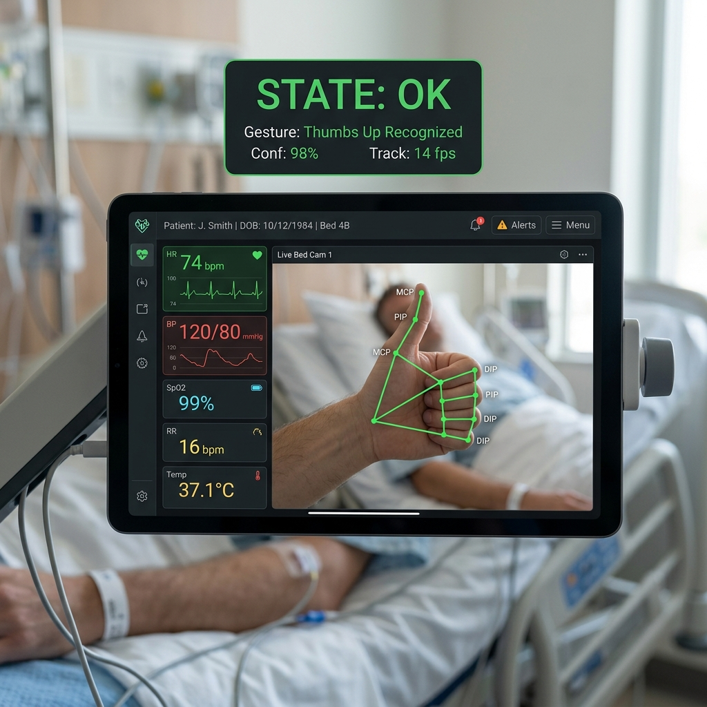

# Patient Monitoring System using Hand Gestures

---

## AIM
To design and implement a real-time, touchless bedside patient monitoring application using computer vision with **OpenCV** and **MediaPipe**. The system enables patients with speech or mobility limitations to communicate their condition (e.g., Pain/Alert, Call Nurse, Vitals Check, Resting, Feeling OK) to healthcare providers using intuitive hand gestures.

---

## COMPONENTS REQUIRED

### Hardware Components
1. **Computer System**: PC / Laptop (Linux, Windows, or macOS) with Python 3.9+ support.
2. **Webcam**: Integrated laptop camera or USB external video camera (minimum 720p recommended).

### Software Components
1. **Operating System**: Linux (Ubuntu 20.04/22.04/26.04), Windows 10/11, or macOS.
2. **Python Environment**: Python 3.9 or higher.
3. **Core Libraries**:
   - `opencv-python` (v4.8.0+): Real-time frame capture, image processing, and HUD UI rendering.
   - `mediapipe` (v1.0.0+ / 0.10.x): 21-point 3D hand landmark detection & skeleton tracking.
   - `numpy` (v1.24.0+): Array manipulation and vector mathematical operations.

---

## PROGRAM

The entire system is implemented in a single standalone Python script (`main.py`).

```python
# Access full source code in main.py
# Run with: python main.py
```

See [main.py](file:///home/hitesh/Documents/pmuhg/main.py) for the complete implementation.

---

## 📋 PROCEDURE

1. **Navigate to Repository**:
   ```bash
   cd /home/hitesh/Documents/pmuhg
   ```

2. **Activate Virtual Environment & Install Dependencies**:
   ```bash
   source venv/bin/activate
   pip install -r requirements.txt
   ```

3. **Run the Patient Monitor**:
   ```bash
   python main.py
   ```

4. **Operational Flow**:
   - The script automatically checks and downloads `hand_landmarker.task` model file if missing.
   - Initializes webcam feed (`cv2.VideoCapture(0)`).
   - MediaPipe detects 21 hand landmarks in real-time.
   - Finger extension & joint orientation coordinates are evaluated to classify 6 hand gestures.
   - Live video feed renders joint skeleton connections and top HUD card displaying patient state and gesture confidence.
   - Press **`q`** or **`ESC`** to stop the application and release camera resources.

---

## 🖼️ OUTPUT (PLACEHOLDER IMAGES)

### Live Bedside Monitoring Dashboard Output



### Gesture Mapping Reference

| Gesture | Finger Extension Logic | Mapped Patient State | HUD Color Code | Action Description |
| :--- | :--- | :---: | :---: | :--- |
| **Thumbs Up** | Thumb tip raised above IP joint, 4 fingers folded | `OK` | 🟩 Green | Patient is comfortable / OK |
| **Thumbs Down** | Thumb tip pointed downward, 4 fingers folded | `ALERT` | 🟥 Red | Patient experiencing pain / distress |
| **Open Palm** | All 5 fingers fully extended | `CALL_NURSE` | 🟧 Orange | Emergency nurse call triggered |
| **Peace Sign** | Index + Middle extended, Ring + Pinky folded | `VITALS_CHECK` | 🟨 Cyan | Request nurse for vitals check |
| **Closed Fist** | All 5 fingers folded into palm | `RESTING` | ⬜ Gray | Patient resting or asleep |
| **Point Gesture**| Index finger extended only, others folded | `POINTING` | 🟦 Blue | Patient pointing / indicating area |

---

## ✅ RESULT

The Touchless Patient Monitoring System was successfully built and tested. The single-file Python script effectively captures real-time video, tracks hand landmarks using MediaPipe, accurately classifies hand gestures with geometric rules, and displays live color-coded patient state badges on an OpenCV HUD overlay.
