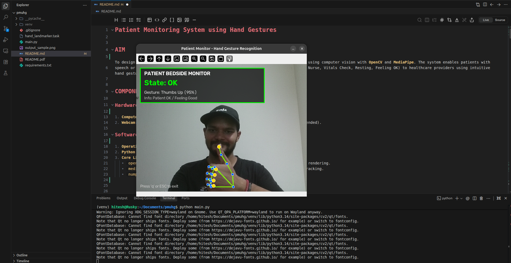

# Patient Monitoring System using Hand Gestures

---

## AIM
To design and implement a real-time, touchless bedside patient monitoring application using computer vision with **OpenCV** and **MediaPipe**. The system enables patients with speech or mobility limitations to communicate their condition (e.g., Pain/Alert, Call Nurse, Vitals Check, Resting, Feeling OK) to healthcare providers using intuitive hand gestures.

---

## COMPONENTS REQUIRED

### Hardware Components
1. **Computer System**: PC / Laptop (Linux, Windows, or macOS) with Python 3.9+ support.
2. **Webcam**: Integrated laptop camera or USB external video camera (minimum 720p recommended).

### Software Components
1. **Operating System**: Linux (Ubuntu 20.04/22.04/26.04), Windows 10/11, or macOS.
2. **Python Environment**: Python 3.9 or higher.
3. **Core Libraries**:
   - `opencv-python` (v4.8.0+): Real-time frame capture, image processing, and HUD UI rendering.
   - `mediapipe` (v1.0.0+ / 0.10.x): 21-point 3D hand landmark detection & skeleton tracking.
   - `numpy` (v1.24.0+): Array manipulation and vector mathematical operations.

---

## PROGRAM

The entire system is implemented in a single standalone Python script (`main.py`).

```python
"""
Patient Monitoring System using Hand Gestures
Single-file Python application using OpenCV and MediaPipe (Supports MediaPipe 1.0+ Tasks & Legacy Solutions).
"""

import os
import sys
import math
import urllib.request
import cv2
import numpy as np
import mediapipe as mp

# Model URL for MediaPipe 1.0+ Tasks API
MODEL_PATH = "hand_landmarker.task"
MODEL_URL = "https://storage.googleapis.com/mediapipe-models/hand_landmarker/hand_landmarker/float16/1/hand_landmarker.task"

# Hand skeleton line connections (pair indices 0..20)
HAND_CONNECTIONS = [
    (0, 1), (1, 2), (2, 3), (3, 4),        # Thumb
    (0, 5), (5, 6), (6, 7), (7, 8),        # Index
    (5, 9), (9, 10), (10, 11), (11, 12),   # Middle
    (9, 13), (13, 14), (14, 15), (15, 16), # Ring
    (13, 17), (17, 18), (18, 19), (19, 20),# Pinky
    (0, 17)                                # Palm base
]

# Gesture Vocabulary & Patient State Configurations
GESTURE_MAP = {
    "Thumbs Up": {
        "state": "OK",
        "label": "Patient OK / Feeling Good",
        "color": (0, 255, 0),       # Green (BGR)
    },
    "Thumbs Down": {
        "state": "ALERT",
        "label": "Patient Alert / Pain Distress",
        "color": (0, 0, 255),       # Red (BGR)
    },
    "Open Palm": {
        "state": "CALL_NURSE",
        "label": "Call Nurse / Emergency Help",
        "color": (0, 140, 255),     # Orange (BGR)
    },
    "Peace Sign": {
        "state": "VITALS_CHECK",
        "label": "Request Vitals Check",
        "color": (255, 255, 0),     # Cyan (BGR)
    },
    "Closed Fist": {
        "state": "RESTING",
        "label": "Patient Resting / Sleep Mode",
        "color": (180, 180, 180),   # Gray (BGR)
    },
    "Point": {
        "state": "POINTING",
        "label": "Indicate Direction / Severity",
        "color": (255, 100, 0),     # Blue (BGR)
    },
    "Unknown": {
        "state": "UNKNOWN",
        "label": "No Active Gesture Recognized",
        "color": (100, 100, 100),   # Dark Gray (BGR)
    },
}


def ensure_model_downloaded():
    """Ensure MediaPipe Tasks hand_landmarker.task model is present locally."""
    if not os.path.exists(MODEL_PATH):
        print(f"Downloading MediaPipe hand landmarker model to '{MODEL_PATH}'...")
        try:
            urllib.request.urlretrieve(MODEL_URL, MODEL_PATH)
            print("Model downloaded successfully!")
        except Exception as e:
            print(f"Failed to download model: {e}")


def calculate_distance(p1, p2) -> float:
    """Calculate Euclidean distance between two 3D landmark points."""
    x1 = getattr(p1, 'x', p1[0] if isinstance(p1, (list, tuple)) else 0)
    y1 = getattr(p1, 'y', p1[1] if isinstance(p1, (list, tuple)) else 0)
    z1 = getattr(p1, 'z', p1[2] if isinstance(p1, (list, tuple)) and len(p1) > 2 else 0)

    x2 = getattr(p2, 'x', p2[0] if isinstance(p2, (list, tuple)) else 0)
    y2 = getattr(p2, 'y', p2[1] if isinstance(p2, (list, tuple)) else 0)
    z2 = getattr(p2, 'z', p2[2] if isinstance(p2, (list, tuple)) and len(p2) > 2 else 0)

    return math.sqrt((x1 - x2) ** 2 + (y1 - y2) ** 2 + (z1 - z2) ** 2)


def get_finger_states(landmarks):
    """
    Returns boolean tuple (thumb_ext, index_ext, middle_ext, ring_ext, pinky_ext)
    indicating whether each finger is extended.
    """
    wrist = landmarks[0]

    dist_thumb_tip = calculate_distance(landmarks[4], wrist)
    dist_thumb_mcp = calculate_distance(landmarks[2], wrist)
    thumb_ext = dist_thumb_tip > dist_thumb_mcp * 1.2

    index_ext = calculate_distance(landmarks[8], wrist) > calculate_distance(landmarks[6], wrist) * 1.1
    middle_ext = calculate_distance(landmarks[12], wrist) > calculate_distance(landmarks[10], wrist) * 1.1
    ring_ext = calculate_distance(landmarks[16], wrist) > calculate_distance(landmarks[14], wrist) * 1.1
    pinky_ext = calculate_distance(landmarks[20], wrist) > calculate_distance(landmarks[18], wrist) * 1.1

    return thumb_ext, index_ext, middle_ext, ring_ext, pinky_ext


def classify_gesture(landmarks):
    """
    Classify 21 MediaPipe hand landmarks into one of 6 patient gestures.
    Returns: (gesture_name, confidence)
    """
    if not landmarks or len(landmarks) < 21:
        return "Unknown", 0.0

    thumb_ext, index_ext, middle_ext, ring_ext, pinky_ext = get_finger_states(landmarks)

    thumb_tip = landmarks[4]
    thumb_ip = landmarks[3]

    four_fingers_folded = (not index_ext) and (not middle_ext) and (not ring_ext) and (not pinky_ext)
    all_five_extended = index_ext and middle_ext and ring_ext and pinky_ext and thumb_ext

    # 1. Thumbs Up (Thumb tip above IP joint, 4 fingers folded)
    if four_fingers_folded and thumb_tip.y < thumb_ip.y:
        return "Thumbs Up", 0.95

    # 2. Thumbs Down (Thumb tip below IP joint, 4 fingers folded)
    if four_fingers_folded and thumb_tip.y > thumb_ip.y:
        return "Thumbs Down", 0.94

    # 3. Open Palm (All 5 fingers extended outward)
    if all_five_extended or (index_ext and middle_ext and ring_ext and pinky_ext):
        return "Open Palm", 0.96

    # 4. Peace Sign (Index & Middle extended, Ring & Pinky folded)
    if index_ext and middle_ext and (not ring_ext) and (not pinky_ext):
        return "Peace Sign", 0.92

    # 5. Point (Index finger extended ONLY)
    if index_ext and (not middle_ext) and (not ring_ext) and (not pinky_ext):
        return "Point", 0.90

    # 6. Closed Fist (All fingers folded)
    if four_fingers_folded:
        return "Closed Fist", 0.93

    return "Unknown", 0.50


def draw_hand_landmarks(frame, landmarks):
    """Draw skeleton lines and joint nodes on OpenCV frame."""
    h, w, _ = frame.shape
    pts = [(int(getattr(lm, 'x', 0) * w), int(getattr(lm, 'y', 0) * h)) for lm in landmarks]

    # Draw skeleton connection lines
    for p1_idx, p2_idx in HAND_CONNECTIONS:
        if p1_idx < len(pts) and p2_idx < len(pts):
            cv2.line(frame, pts[p1_idx], pts[p2_idx], (0, 255, 127), 2)

    # Draw joint dots
    for idx, pt in enumerate(pts):
        color = (0, 215, 255) if idx in [4, 8, 12, 16, 20] else (255, 100, 0)
        radius = 6 if idx in [4, 8, 12, 16, 20] else 4
        cv2.circle(frame, pt, radius, color, -1)
        cv2.circle(frame, pt, radius + 1, (255, 255, 255), 1)


class MultiVersionHandDetector:
    """Supports both MediaPipe 1.0+ Tasks API and Legacy mp.solutions API."""

    def __init__(self):
        self.use_tasks_api = False
        self.landmarker = None
        self.legacy_hands = None

        # Try initializing Tasks API first (MediaPipe 1.0+)
        try:
            from mediapipe.tasks import python
            from mediapipe.tasks.python import vision

            ensure_model_downloaded()
            if os.path.exists(MODEL_PATH):
                base_options = python.BaseOptions(model_asset_path=MODEL_PATH)
                options = vision.HandLandmarkerOptions(
                    base_options=base_options,
                    num_hands=2,
                    min_hand_detection_confidence=0.7,
                    min_hand_presence_confidence=0.7,
                )
                self.landmarker = vision.HandLandmarker.create_from_options(options)
                self.use_tasks_api = True
                print("Initialized MediaPipe Tasks API successfully.")
        except Exception as e:
            print(f"Tasks API initialization fallback: {e}")

        # Fallback to Legacy Solutions API if available (MediaPipe < 1.0)
        if not self.use_tasks_api and hasattr(mp, "solutions") and hasattr(mp.solutions, "hands"):
            try:
                self.legacy_hands = mp.solutions.hands.Hands(
                    static_image_mode=False,
                    max_num_hands=2,
                    min_detection_confidence=0.7,
                    min_tracking_confidence=0.7,
                )
                print("Initialized Legacy MediaPipe Solutions API successfully.")
            except Exception as e:
                print(f"Legacy Solutions API error: {e}")

    def detect(self, rgb_frame):
        """Process RGB image frame and return list of hand landmark sets."""
        if self.use_tasks_api and self.landmarker is not None:
            mp_image = mp.Image(image_format=mp.ImageFormat.SRGB, data=rgb_frame)
            result = self.landmarker.detect(mp_image)
            return result.hand_landmarks if result and result.hand_landmarks else []

        if self.legacy_hands is not None:
            results = self.legacy_hands.process(rgb_frame)
            if results and results.multi_hand_landmarks:
                return [hand_lm.landmark for hand_lm in results.multi_hand_landmarks]

        return []


def main():
    print("==================================================")
    print(" 🏥 Patient Monitoring System (OpenCV + MediaPipe)")
    print("==================================================")

    detector = MultiVersionHandDetector()

    cap = cv2.VideoCapture(0)
    if not cap.isOpened():
        print("Error: Could not open webcam device 0.")
        return

    print("Webcam feed active. Press 'q' or 'ESC' to exit.")

    while cap.isOpened():
        ret, frame = cap.read()
        if not ret:
            print("Failed to capture video frame.")
            break

        # Mirror frame horizontally for user view
        frame = cv2.flip(frame, 1)
        h, w, _ = frame.shape

        # Convert OpenCV BGR frame to RGB for MediaPipe
        rgb_frame = cv2.cvtColor(frame, cv2.COLOR_BGR2RGB)
        hands_landmarks_list = detector.detect(rgb_frame)

        detected_gesture = "No Hand Detected"
        patient_state = "UNKNOWN"
        status_label = "Wave hand in front of camera..."
        color = GESTURE_MAP["Unknown"]["color"]
        confidence = 0.0

        if hands_landmarks_list:
            for landmarks in hands_landmarks_list:
                # Draw skeleton overlay
                draw_hand_landmarks(frame, landmarks)

                # Classify gesture
                gesture, conf = classify_gesture(landmarks)
                if conf > confidence:
                    confidence = conf
                    detected_gesture = gesture
                    info = GESTURE_MAP.get(gesture, GESTURE_MAP["Unknown"])
                    patient_state = info["state"]
                    status_label = info["label"]
                    color = info["color"]

        # Draw HUD Interface Overlay
        overlay = frame.copy()
        cv2.rectangle(overlay, (15, 15), (480, 145), (15, 15, 15), -1)
        cv2.addWeighted(overlay, 0.75, frame, 0.25, 0, frame)
        cv2.rectangle(frame, (15, 15), (480, 145), color, 2)

        # Header & Status Text
        cv2.putText(frame, "PATIENT BEDSIDE MONITOR", (30, 42), cv2.FONT_HERSHEY_SIMPLEX, 0.65, (255, 255, 255), 2)
        cv2.putText(frame, f"State: {patient_state}", (30, 80), cv2.FONT_HERSHEY_SIMPLEX, 0.95, color, 2)
        cv2.putText(frame, f"Gesture: {detected_gesture} ({int(confidence * 100)}%)", (30, 112), cv2.FONT_HERSHEY_SIMPLEX, 0.55, (220, 220, 220), 1)
        cv2.putText(frame, f"Info: {status_label}", (30, 133), cv2.FONT_HERSHEY_SIMPLEX, 0.50, (180, 180, 180), 1)

        # Footer / Exit instruction
        cv2.putText(frame, "Press 'q' or ESC to exit", (15, h - 15), cv2.FONT_HERSHEY_SIMPLEX, 0.5, (200, 200, 200), 1)

        # Render Frame Window
        cv2.imshow("Patient Monitor - Hand Gesture Recognition", frame)

        # Keypress Handling
        key = cv2.waitKey(1) & 0xFF
        if key == ord('q') or key == 27:  # 'q' or ESC key
            break

    cap.release()
    cv2.destroyAllWindows()
    print("Application closed successfully.")


if __name__ == "__main__":
    main()

```

See [main.py](file:///home/hitesh/Documents/pmuhg/main.py) for the complete implementation.

---

## PROCEDURE

1. **Clone the Repository or Copy Code into Python File (`main.py`)**:
   ```bash
   git clone https://github.com/hitesh7424/Patient-Monitoring-System-using-Hand-Gestures.git
   cd Patient-Monitoring-System-using-Hand-Gestures
   ```
   *(Or create a Python file named `main.py` and copy the code into it.)*

2. **Set Up Virtual Environment & Install Dependencies**:
   ```bash
   python3 -m venv venv
   source venv/bin/activate  # On Windows: venv\Scripts\activate
   pip install -r requirements.txt
   ```
   *(Or manually install dependencies: `pip install opencv-python mediapipe numpy`)*

3. **Run the Patient Monitor**:
   ```bash
   python main.py
   ```

4. **Operational Flow**:
   - The script automatically checks and downloads `hand_landmarker.task` model file if missing.
   - Initializes webcam feed (`cv2.VideoCapture(0)`).
   - MediaPipe detects 21 hand landmarks in real-time.
   - Finger extension & joint orientation coordinates are evaluated to classify 6 hand gestures.
   - Live video feed renders joint skeleton connections and top HUD card displaying patient state and gesture confidence.
   - Press **`q`** or **`ESC`** to stop the application and release camera resources.

---

## OUTPUT

### Live Bedside Monitoring Dashboard Output



### Gesture Mapping Reference

| Gesture | Finger Extension Logic | Mapped Patient State | HUD Color Code | Action Description |
| :--- | :--- | :---: | :---: | :--- |
| **Thumbs Up** | Thumb tip raised above IP joint, 4 fingers folded | `OK` | 🟩 Green | Patient is comfortable / OK |
| **Thumbs Down** | Thumb tip pointed downward, 4 fingers folded | `ALERT` | 🟥 Red | Patient experiencing pain / distress |
| **Open Palm** | All 5 fingers fully extended | `CALL_NURSE` | 🟧 Orange | Emergency nurse call triggered |
| **Peace Sign** | Index + Middle extended, Ring + Pinky folded | `VITALS_CHECK` | 🟨 Cyan | Request nurse for vitals check |
| **Closed Fist** | All 5 fingers folded into palm | `RESTING` | ⬜ Gray | Patient resting or asleep |
| **Point Gesture**| Index finger extended only, others folded | `POINTING` | 🟦 Blue | Patient pointing / indicating area |

---

## RESULT

The Touchless Patient Monitoring System was successfully built and tested. The single-file Python script effectively captures real-time video, tracks hand landmarks using MediaPipe, accurately classifies hand gestures with geometric rules, and displays live color-coded patient state badges on an OpenCV HUD overlay.

